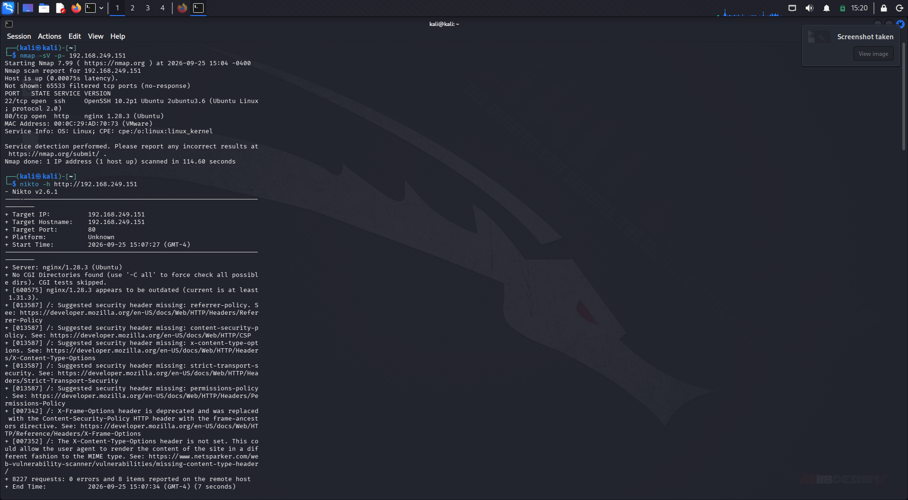
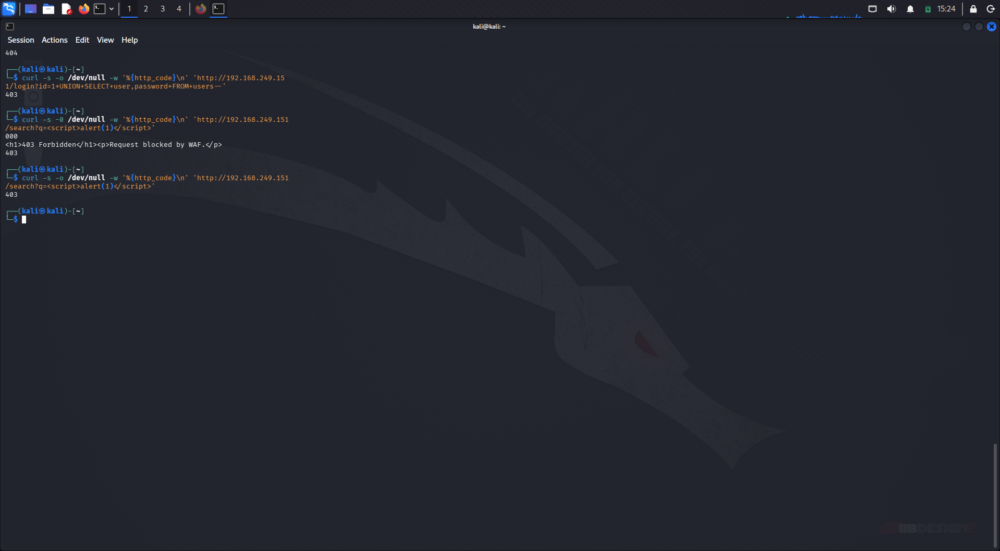
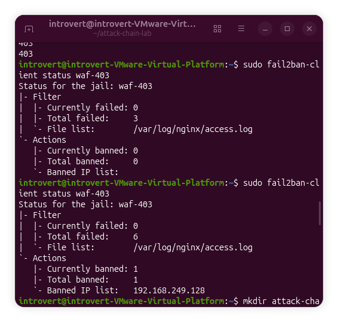
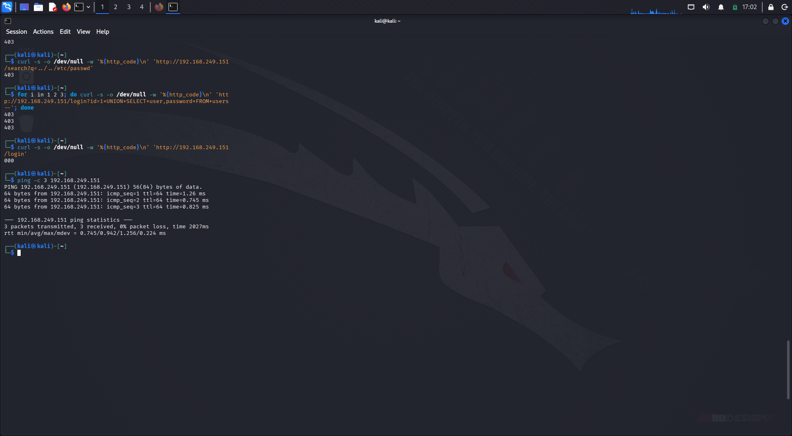

# Attack Chain Lab — Recon, Exploitation, and Automated Response

A full attack-chain simulation combining network security and application security: reconnaissance from an attacker machine (Kali), remote exploitation of a vulnerable web app, and automated network-layer defense using fail2ban — demonstrating detection and response across multiple layers of the stack.

## Purpose

Builds on the [WAF Lab](https://github.com/6ix-hubb/vulnapp-waf-lab) by simulating a complete attacker kill chain against that same target, then adding automated defense: an attacker who repeatedly trips the WAF gets locked out at the network layer entirely.

## Architecture
Kali (Attacker VM, 192.168.249.128)
|
| network recon + exploitation attempts
v
Ubuntu (Target VM, 192.168.249.151)
Nginx + ModSecurity v3 + OWASP CRS v4.7 --> vulnapp (Flask, port 3000)
fail2ban watching Nginx access.log for repeated 403s
UFW firewall enforcing the ban


## Attack Chain

### Phase 1: Network Reconnaissance

**Nmap** (all ports, service detection):
```bash
nmap -sV -p- 192.168.249.151
```
Result: SSH (22) and HTTP/Nginx (80) open. Port 3000 (Flask backend) correctly **not** reachable directly — confirms the app is only accessible through the WAF, not exposed on the network.

**Nikto** (web fingerprinting):
```bash
nikto -h http://192.168.249.151
```
Result: identified missing security headers (CSP, HSTS, X-Content-Type-Options) and an outdated Nginx version — real findings, documented as recommendations. Nikto's scan itself tripped the WAF's scanner-detection rule (CRS 913100).


### Phase 2: Remote Exploitation

Ran the same SQL Injection and XSS payloads from the [WAF Lab](https://github.com/6ix-hubb/vulnapp-waf-lab), this time from Kali over the network instead of localhost:

```bash
curl -s -o /dev/null -w '%{http_code}\n' 'http://192.168.249.151/login?id=1+UNION+SELECT+user,password+FROM+users--'
curl -s -o /dev/null -w '%{http_code}\n' 'http://192.168.249.151/search?q=<script>alert(1)</script>'
```
Both returned `403` — confirming the WAF blocks real network-originated attacks, not just local test traffic.



### Phase 3: Automated Response (fail2ban)

Configured fail2ban to watch Nginx's access log for repeated 403 responses and ban offending IPs at the firewall level.

**Filter** (`configs/waf-403.conf`):
```ini
[Definition]
failregex = ^<HOST> .* "(GET|POST) .*" 403
ignoreregex =
```

**Jail policy:** 3 violations within 60 seconds → 300 second ban.



### Phase 4: Verified Lockout

After tripping 3 violations in quick succession, the attacker's IP was banned:
Currently banned: 1
Banned IP list: 192.168.249.128


Follow-up requests from Kali failed to connect entirely (network-layer block, before reaching the WAF):
```bash
curl -s -o /dev/null -w '%{http_code}\n' 'http://192.168.249.151/login'
# 000 — connection refused
```
ICMP (ping) remained reachable, confirming the block was targeted at the HTTP attack vector rather than a blanket network outage.




## Known Limitation: Slow/Low-and-Slow Attacks

fail2ban's ban logic is based on a sliding time window (`findtime`). An attacker who paces requests slower than that window (e.g., one attack every 90 seconds against a 60-second window) is never banned, since the violation count resets before the threshold is reached.

**Mitigations for a production deployment:**
- Lower `maxretry` and lengthen `findtime` based on real traffic baselines
- Enable fail2ban's built-in `recidive` jail to escalate bans for repeat offenders across multiple windows
- Add Nginx-level rate limiting (`limit_req`) as a second, count-independent layer
- Note that even unbanned slow attackers still get blocked per-request by the WAF's anomaly scoring — the risk is reduced to "attacker stays unbanned," not "attack succeeds"

## Tech Stack

- Kali Linux (attacker), Ubuntu 22.04 (target)
- Nmap, Nikto
- Nginx + ModSecurity v3 + OWASP CRS v4.7
- fail2ban
- UFW


## Disclaimer

Built for educational purposes as part of Network & System Security coursework, using only VMs I own and control. Do not run these tools against systems you do not have explicit permission to test.
